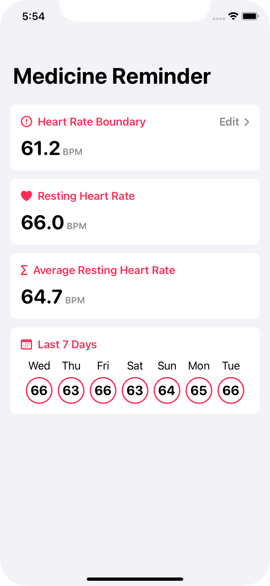
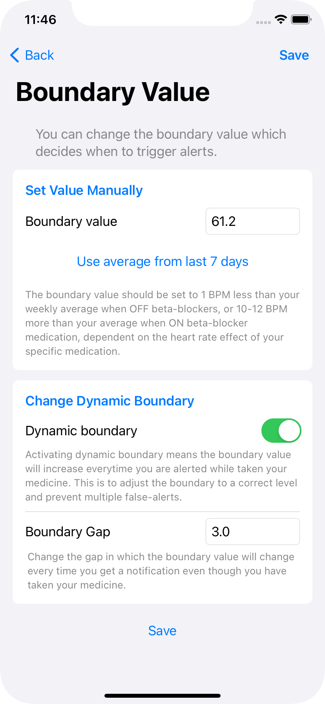
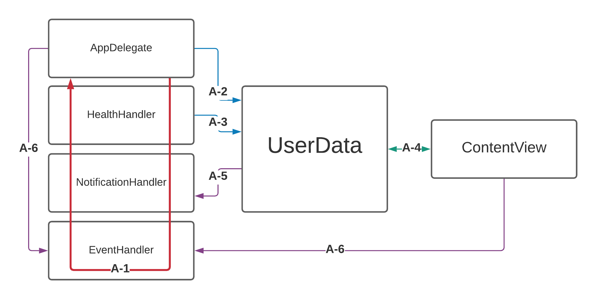
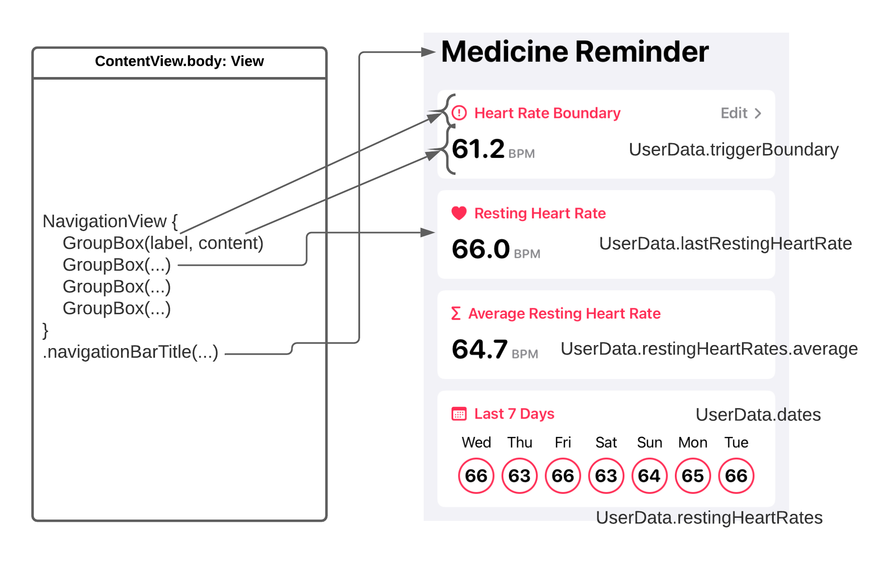
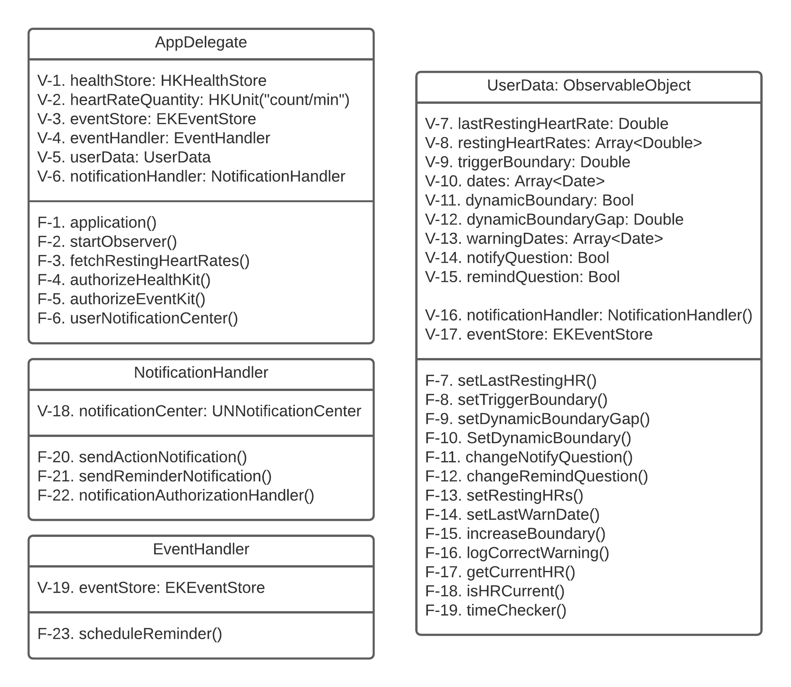

# Medicine-Reminder
The application "MedRem" was developed as part of my master thesis. It is a MVP, aimed at reminding patients suffering from heart disease to take their beta-blocker medication. 

# Flow

The completed demo application flow is very similar to the [Background App](https://github.com/Jaanesen/Background-App) because it also uses the functionality from the Heart Rate app and the Notification app to test if it is working. However, in the MedRem application, the amount of notifications dispatched has to be limited by certain parameters. The current flow of how a notification ends up being dispatched is as follows:
        
User unlocks phone which allows the device to access the HealthKit Store
 - If there is a new resting heart rate value, the background observer query will be triggered and call its update handler.
 - The update handler calls for a statistical collection query to retrieve the new value(s).
 - The values in the app is then updated with the new ones. And the app checks:
    - If the most recent resting heart rate value is valid.
    - If the resting heart rate is higher than the set boundary.
    - If the time is between 14:00 and 20:00.
    - If it is at least 10 minutes since the last notification was dispatched.
 - If the previous parameters pass, the app schedules an actionable notification to warn about the possibility that the user has forgotten to take its medication, based on the resting heart rate value. 
 
Even though the MedRem application has almost the identical flow of the Background App, MedRem is more complicated structured internally. The app is divided into 6 different main sections, as displayed in the figure: 

- The main controller of the application. Because of the background running query and authorization handling, the app uses an AppDelegate to handle the app lifecycle. The AppDelegate initializes the app by doing the authorization handling and starts the different HealthKit queries to fetch information to the app and begin the background functionality. The AppDelegate has instances of the Health, Notification and Event-handlers such that it can authorize the different frameworks and manage their behaviours. In addition to these responsibilities, the AppDelegate also handles the different actions a user can perform through an actionable notification.            
- The health handler is the class where everything related to the HealthKit framework is handled. It consists of primarily three functions concerning authorizing HealthKit, executing observer- and statistical collection queries.      
- The notification handler is the class where the notification related part of the application is, apart from handling the actions defined in the actionable notifications. This class has functions for dispatching the different notifications used by the application and authorizing the User Notification framework to be used by the application.
- The event handler handles authorization of EventKit and schedules reminders to the Reminders app. 
- The brain of the application is the UserData class. This is where all app- and HR-related data is temporarily stored and handled. UserData is also an observed object which allows the various views and functions in the application to access the different user data. As well as being central storage of information, the class also decides to dispatch notifications based on the incoming data.  
- ContentView works as the face of the application. Because MedRem does not use the SwiftUI-lifecycle, it has a SceneDelegate which assigns ContentView as the root view. As the root view, ContentView has to handle navigation and the appearance of the app. Because the app is purposed for background use, the app has a simple user interface with very few items and views to handle for navigation. The main navigation in the app is between the main page and the settings page. 
       
How the different sections communicate is illustrated through the arrows A-1 to A-6 in the figure. The arrows indicate the following:

- [A-1] This communication line mainly regards the AppDelegate using its objects of the respective classes to authorize the different frameworks and functionality.
- [A-2] AppDelegate accesses various functions in UserData to reflect changes made from notification action answers. 
- [A-3] HealthHandler communicates with UserData by supplying it with new resting-HR values every time the observer query triggers, as well as when the application is launched. 
- [A-4] ContentView and the various sub-views has instances of the environment object of UserData, using it to display the different values throughout the application. 
- [A-5] UserData checks the values it is supplied with from the health handler, and if the right parameters pass, it will schedule a notification through the notification handler.
- [A-6] Dependent on whether the user responds to the app through the notification actions or in-app actions, the AppDelegate or ContentView will use the event handler to schedule a reminder for later if the user asks for it.

        
After the notification has been dispatched, it is up to the user to react to the notification's actions. If the user answers yes to whether they have taken their medication, the boundary value will be increased to adjust because of a "false" warning.

# SwiftUI Views

The UI of the MedRem app is created using the SwiftUI framework. As displayed in the Figure, the main page's view is only built up by four GroupBox views inside a navigation view with an assigned title. Each of the GroupBox views is provided with a label and content. We have used Apples Label structure for the label, allowing us to create a label with an icon. The content section of the GroupBox allows for more flexibility, where it is possible to assign custom styles. In the Figure there is one style used for the first three GroupBoxes, which displays one HR value with a unit type, and one style for the final GroupBox, which displays 7 days and their respective HR values. On the right side of the screenshot, it is written the respective UserData values used by the different view components.

# Class Diagram

